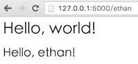

# 使用 Jinja2 模板引擎

## 什么是模板引擎

在 Web 开发中，我们经常会使用到模板引擎。简单点来说，我们可以**把模板看成是一个含有某些变量的字符串，它们的具体值需要在动态运行时（请求的上下文）才能知道**。比如，有下面一个模板：

```html
<h1>Hello, {{ name }}!</h1>
```

其中，name 是一个变量名，我们用 `{{ }}` 包裹它表示它是一个变量。我们给 name 传不同的值，模板会返回不同的字符串。像这样，使用真实的值替换变量，再返回最终得到的响应字符串，这一过程称为**渲染**。**模板引擎就是渲染模板的程序。**

Flask 默认使用 [Jinja2](http://jinja.pocoo.org/) 模板引擎。

## 为什么要使用模板引擎

先来看一个简单的程序。

```python
$ cat hello.py

from flask import Flask

app = Flask(__name__)

@app.route("/<name>")
def hello(name):
    if name == 'ethan':
        return "<h1>Hello, world!</h1> <h2>Hello, %s!</h2>" % name
    else:
        return "<h1>Hello, world!</h1> <h2>Hello, world!</h2>"

if __name__ == "__main__":
    app.run()
```

在终端运行上面的代码 `python hello.py`，终端输出：

```
 * Running on http://127.0.0.1:5000/ (Press CTRL+C to quit)
```

我们在浏览器地址栏输入 `http://127.0.0.1:5000/ethan`，显示如下：



符合预期，没什么问题。但是，我们看到，上面的视图函数 `hello()` 夹杂了一些 `HTML` 代码，如果 HTML 代码多了，会使得我们的程序变得难以理解和维护。我们可以看到，其实视图函数主要有两部分逻辑：业务逻辑和表现逻辑。像上下文判断，数据库查询等后台处理都可以算是业务逻辑，而返回给前端的响应内容则算是表现逻辑，它们是需要在前端展现的。

在上面的代码中，我们将业务逻辑和表现逻辑混杂在一起了，代码很不优雅，而且当代码变多了后，程序将会变得难以理解和维护。因此，良好的做法应该是将业务逻辑和表现逻辑分开，模板引擎正好可以满足这种需求。

## Jinja 模板引擎入门

我们将上面的例子用 Jinja 模板进行改写。默认情况下，Flask 在程序文件夹中的 templates 子文件夹中寻找模板。改写后的文件结构如下：

```
.
├── hello.py
└── templates
    └── index.html
```

`hello.py` 文件内容如下：

```python
from flask import Flask, render_template

app = Flask(__name__)

@app.route('/<name>')
def hello(name):
    if name == 'ethan':
        return render_template('index.html', name=name)
    else:
        return render_template('index.html', name='world')
        
if __name__ == "__main__":
    app.run()
```

`index.html` 文件内容如下：

```
<h1>Hello, world!</h1> <h2>Hello, {{ name }}!</h2>
```

在 `hello.py` 中，我们使用了Flask 提供的 render_template 函数，该函数把 Jinja2 模板引擎集成到了程序中。render_template 函数的第一个参数是模板的文件名。随后的参数都是键值对，表示模板中变量对应的真实值。

### 变量

Jinja 模板使用 `{{ 变量名 }}` 表示一个变量，比如上面的 `{{ name }}`，它告诉模板引擎这个位置的值从渲染模板时使用的数据中获取。

在 Jinja 中，还能使用列表，字典和对象等复杂的类型，比如：

```
<p> Hello, {{ mydict['key'] }}. Hello, {{ mylist[0] }}. </p>
```

### 控制结构

Jinja 提供了多种控制结构，来改变模板的渲染流程，比如常见的判断结构，循环结构。示例如下：

```python

    <p> Hello, {{ user }} </p>

    <p> Hello, world! </p>


<ul>
    
        <li> {{ user }} </li>
    
</ul>
```

### 宏

当有一段代码我们经常要用到的时候，我们往往会写一个函数，在 Jinja 中，我们可以使用宏来实现。例如:

```python

    
        <p> Hello, {{ user }} </p>
    

```

为了重复使用宏，我们将其保存在单独的文件中，比如 'macros.html'，然后在需要使用的模板中导入：

```

    
{{ macros.render_user(user) }}
```

### 模板继承

另一种重复使用代码的强大方式是**模板继承**，就像类继承需要有一个**基类**一样，我们需要一个**基模板**。比如，我们可以创建一个名为 base.html 的基模板：

```html
<html>
<head>
    
    <title> - My Application</title> 
    
</head>

<body>
    
     
</body>
</html>
```

我们可以看到上面的基模板含有三个 `block` 块：head、title 和 body。下面，我们通过这个基模板来派生新的模板：

```

Index

    {{ super() }}

<h1>Hello, World!</h1>

```

注意到上面第一行代码使用了 `extends` 命令，表明该模板继承自 base.html。接着，我们重新定义了 title、head 和 body。另外，我们还使用了 super() 获取基模板原来的内容。

更多关于 Jinja 模板引擎的使用可以参考 [Jinja2 2.7 documentation](http://docs.jinkan.org/docs/jinja2/)。

